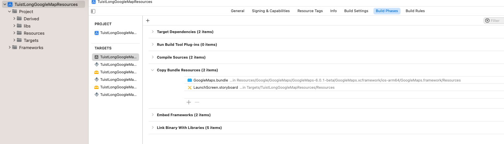
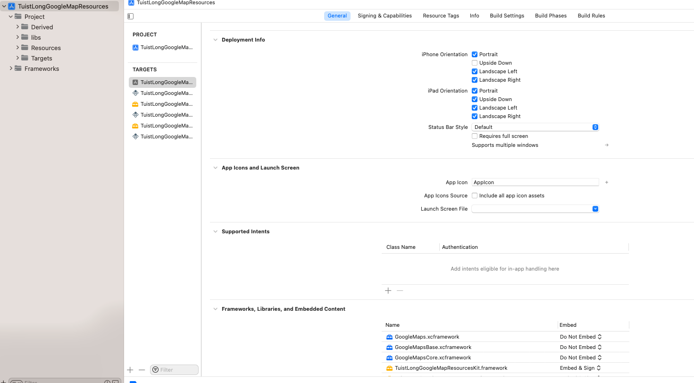

# TuistLongGoogleMapResources

This repository reproduces an issue in Tuist when trying to add resources and frameworks from a specific path.

The example project was generated using the `tuist init` command.

## Layout of the XFrameworks and Resources

In this repository, there are two subfolders, `libs` and `Resources`, both containing a copy of the Google folder. The Google folder holds some beta frameworks of Google Maps, and the same copy is present in both `libs` and `Resources` folders.

Now, this duplication of code and resources in two folders may seem redundant. However, it appears to be a Tuist bug.

To understand the issue, take a look at `Tuist/ProjectDescriptionHelpers/Project+Templates`, specifically the `makeAppTargets` function. You will notice that we added a bundle from the GoogleMaps framework to the app resources, and the dependencies of GoogleMaps as an xcframework.

The resources are pointing to the copy in the `Resources` folder, while the frameworks are pointing to the frameworks in the `libs` folder. As mentioned before, both folders contain the exact same files.

## Reproducing the Issue

Before reproducing the issue, run `tuist generate` to generate the project. You will notice that the app is linked against the xcframeworks, and the bundle is copied in the copy resources build phase (refer to the attached images).

Resources - 
Frameworks -  

To reproduce the issue, you can make the following changes:

1. Change line 62 to fetch the resources from the `libs` folder:
```
.glob(pattern: "libs/Google/GoogleMaps/GoogleMaps-6.0.1-beta/GoogleMaps.xcframework/ios-arm64/GoogleMaps.framework/Resources/GoogleMaps.bundle"),
```
Running `tuist generate` after this change will result in a similar error:
```
Couldn't find a reference for the file at path /Users/danielbac/Documents/TuistLongGoogleMapResources/libs/Google/GoogleMaps/GoogleMaps-6.0.1-beta/GoogleMaps.xcframework.
```

2. Alternatively, you can change any or all of the lines 65-67 to fetch the framework from the Resources folder:
```
.xcframework(path: "Resources/Google/GoogleMaps/GoogleMaps-6.0.1-beta/GoogleMaps.xcframework"),
.xcframework(path: "Resources/Google/GoogleMaps/GoogleMaps-6.0.1-beta/GoogleMapsBase.xcframework"),
.xcframework(path: "Resources/Google/GoogleMaps/GoogleMaps-6.0.1-beta/GoogleMapsCore.xcframework"),
```
Again, running `tuist generate` after this change will result in a similar error:
```
Couldn't find a reference for the file at path /Users/danielbac/Documents/TuistLongGoogleMapResources/Resources/Google/GoogleMaps/GoogleMaps-6.0.1-beta/GoogleMaps.xcframework.
```

Please note that these changes are meant to showcase the issue and may not reflect the intended setup.

